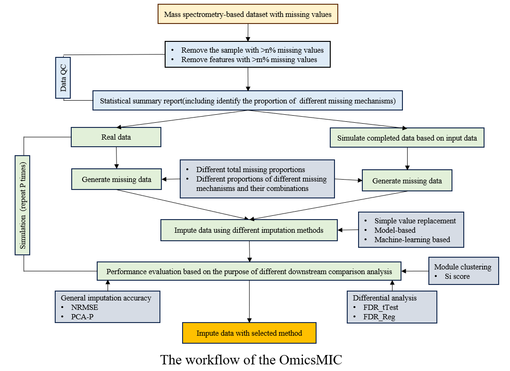

# omicsMIC
omicsMIC: a Comprehensive Benchmarking Platform for Robust Comparison of Imputation Methods in Mass Spectrometry-based Omics Data
### Brief Description
** omicsMIC ** is an interactive web-based platform that provides researchers with a versatile framework to simulate and evaluate the performance of 28 diverse imputation methods. omicsMIC offers a nuanced perspective, acknowledging the inherent heterogeneity in biological data and the unique attributes of each dataset. It can empower researchers to make data-driven decisions in imputation method selection based on real-time visualizations of the outcomes associated with different imputation strategies. omicsMIC can temporarily be accessed at [http://www.omicsMIC.com](https://rhino-neat-woodcock.ngrok-free.app/omicsMIC/) by clicking **"Visit Site"** as shown in the image below.

The omicsMIC interface is shown below:

The omicsMIC workflow is shown below:

