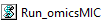

# omicsMIC
omicsMIC: a Comprehensive Benchmarking Platform for Robust Comparison of Imputation Methods in Mass Spectrometry-based Omics Data
### Brief Description
** omicsMIC ** is an interactive web-based platform that provides researchers with a versatile framework to simulate and evaluate the performance of 28 diverse imputation methods. omicsMIC offers a nuanced perspective, acknowledging the inherent heterogeneity in biological data and the unique attributes of each dataset. It can empower researchers to make data-driven decisions in imputation method selection based on real-time visualizations of the outcomes associated with different imputation strategies. omicsMIC can be accessed at [https://rhino-neat-woodcock.ngrok-free.app/omicsMIC/](https://rhino-neat-woodcock.ngrok-free.app/omicsMIC/) by clicking **"Visit Site"** as shown in the image below. 

### Run it locally
omicsMIC can also be run on a local computer. Download the archive named **omicsMIC** from [https://doi.org/10.5281/zenodo.10016741](https://doi.org/10.5281/zenodo.10016741), extract it locally, and then double-click the  file without installing anything.

### Citation

Weiqiang Lin, Jiadong Ji, Kuan-Jui Su, Chuan Qiu, Qing Tian, Lan-Juan Zhao, Zhe Luo, Chong Wu, Hui Shen, Hongwen Deng, omicsMIC: a comprehensive benchmarking platform for robust comparison of imputation methods in mass spectrometry-based omics data, NAR Genomics and Bioinformatics, Volume 6, Issue 2, June 2024, lqae071, https://doi.org/10.1093/nargab/lqae071

### Contact

Welcome to our platform dedicated to supporting the mass spectrometry-based omics research community. Our goal is to provide you with tools to select appropriate data imputation methods based on the specific characteristics of your data.

This is the first version of our platform, and we acknowledge that there may be some issues and numerous areas for optimization and improvement. We are committed to enhancing the platform and making it as useful as possible for your research needs.

If you encounter any challenges or have suggestions for improvements, we would greatly appreciate your feedback. Please do not hesitate to contact us with your insights and recommendations. Please contact [Weiqiang Lin](wlin8@tulane.edu) or leave comments on GitHub. 
